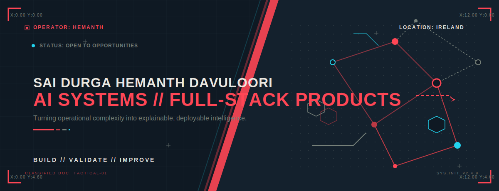
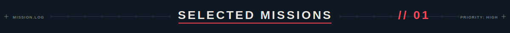
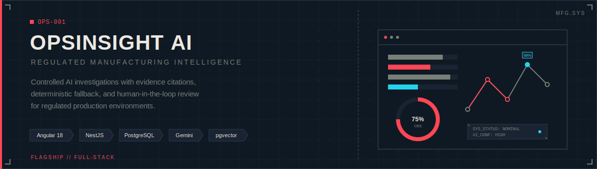
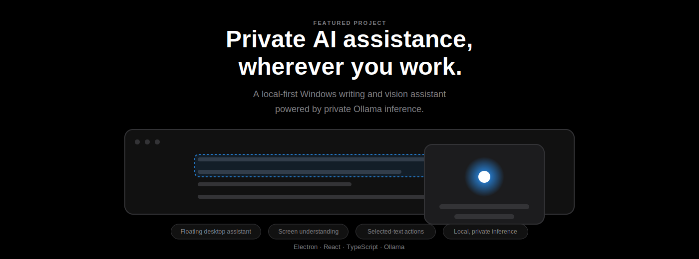
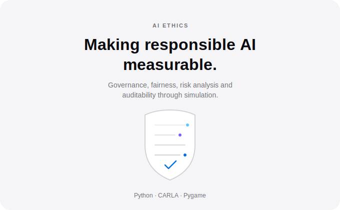
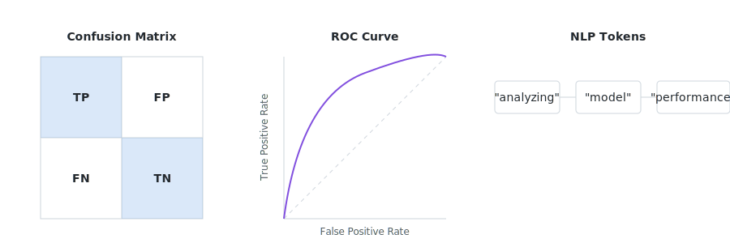
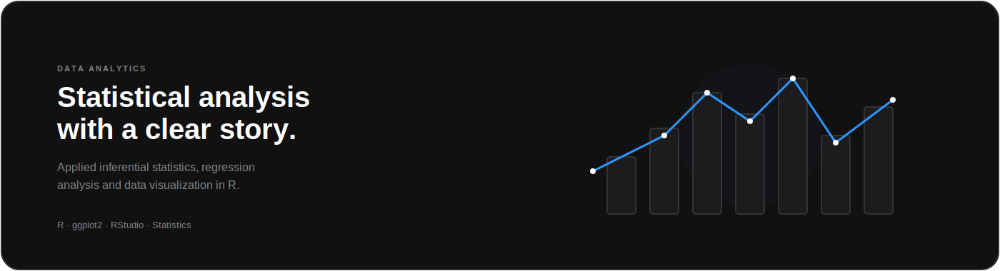
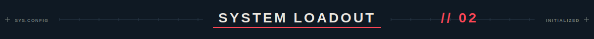
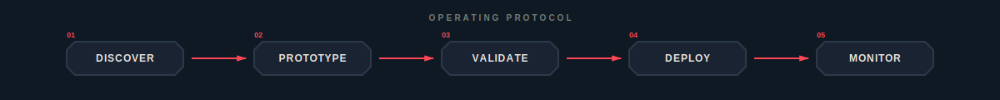
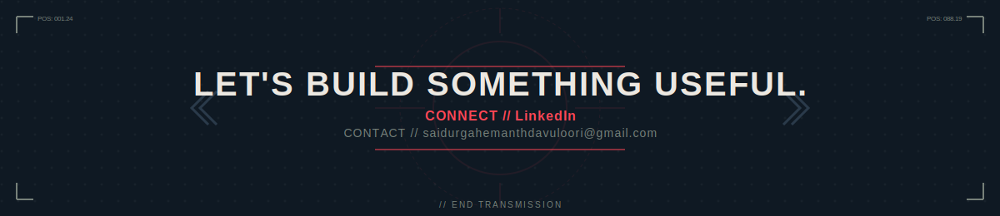

<picture>
  
</picture>

<!-- ─── CONTACT BAR ─── -->

  &nbsp;&nbsp;
  &nbsp;&nbsp;
  

 

<!-- ─── POSITIONING STATEMENT ─── -->

  <strong>AI engineer and full-stack developer building production systems that turn messy operational data into explainable, auditable, and deployable intelligence — from model to UI to infrastructure.</strong>

 

<!-- ─── CAPABILITY PANELS ─── -->

<table>
<tr>
<td width="33%" align="center">

### `// AI SYSTEMS`

Machine learning pipelines, NLP classification, 
responsible AI controls, and LLM-powered 
investigation agents with evidence tracking.

</td>
<td width="33%" align="center">

### `// PRODUCT ENGINEERING`

Full-stack web applications and desktop 
software with Angular, React, NestJS, 
Electron, and modern TypeScript.

</td>
<td width="33%" align="center">

### `// DECISION INTELLIGENCE`

Statistical analysis, data visualization, 
hypothesis testing, and quantitative 
methods for actionable insights.

</td>
</tr>
</table>

 

<!-- ─── SELECTED MISSIONS DIVIDER ─── -->

<picture>
  
</picture>

 

<!-- ─── FLAGSHIP: OPSINSIGHT AI ─── -->

<a href="https://github.com/hemanthdsd/opsinsight-ai">
  <picture>
    
  </picture>
</a>

  

 

<!-- ─── FLAGSHIP: BUDDY AI ─── -->

<a href="https://github.com/hemanthdsd/buddy-ai">
  <picture>
    
  </picture>
</a>

  

 

<!-- ─── TWO-COLUMN: AI ETHICS + ML FOUNDATIONS ─── -->

<table>
<tr>
<td width="50%">

<a href="https://github.com/hemanthdsd/AI-ethics-auditing-simulation">
  <picture>
    
  </picture>
</a>

  

</td>
<td width="50%">

<a href="https://github.com/hemanthdsd/machine-learning-foundations-project">
  <picture>
    
  </picture>
</a>

  

</td>
</tr>
</table>

 

<!-- ─── WIDE: QUANTITATIVE DATA ANALYTICS ─── -->

<a href="https://github.com/hemanthdsd/Qantitative-Data-Analytics-">
  <picture>
    
  </picture>
</a>

  

 

<!-- ─── SYSTEM LOADOUT DIVIDER ─── -->

<picture>
  
</picture>

 

<!-- ─── TECH STACK BADGES ─── -->

<h3 align="center"><code>LANGUAGES</code></h3>

  &nbsp;
  &nbsp;
  &nbsp;
  &nbsp;
  &nbsp;
  &nbsp;
  

<h3 align="center"><code>FRAMEWORKS & PLATFORMS</code></h3>

  &nbsp;
  &nbsp;
  &nbsp;
  &nbsp;
  &nbsp;
  

<h3 align="center"><code>AI / ML / DATA</code></h3>

  &nbsp;
  &nbsp;
  &nbsp;
  &nbsp;
  &nbsp;
  &nbsp;
  

<h3 align="center"><code>INFRASTRUCTURE</code></h3>

  &nbsp;
  &nbsp;
  &nbsp;
  &nbsp;
  

 

<!-- ─── OPERATING PROTOCOL ─── -->

<picture>
  
</picture>

 

<!-- ─── GITHUB STATS ─── -->

<h3 align="center"><code>PERFORMANCE METRICS</code></h3>

  <picture>
    <source media="(prefers-color-scheme: dark)" srcset="https://github-readme-stats.vercel.app/api?username=hemanthdsd&show_icons=true&hide_border=true&bg_color=0F1923&title_color=FF4655&icon_color=22D3EE&text_color=ECE8E1&ring_color=FF4655">
    
  </picture>
  &nbsp;&nbsp;
  <picture>
    <source media="(prefers-color-scheme: dark)" srcset="https://github-readme-stats.vercel.app/api/top-langs/?username=hemanthdsd&layout=compact&hide_border=true&bg_color=0F1923&title_color=FF4655&text_color=ECE8E1">
    
  </picture>

 

<!-- ─── CTA FOOTER ─── -->

<picture>
  
</picture>

 

<!-- ─── END ─── -->

  <code>// PROFILE v2.0 — LAST UPDATED JULY 2026</code>

