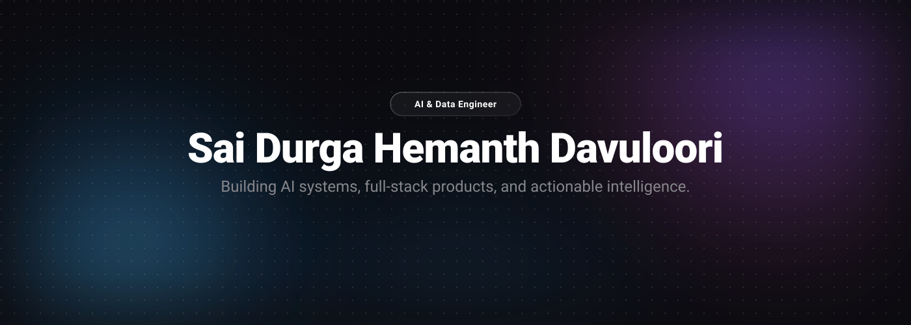
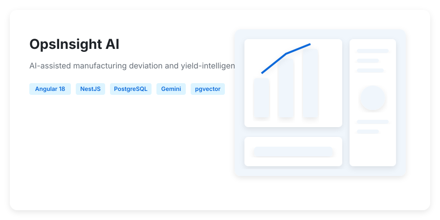
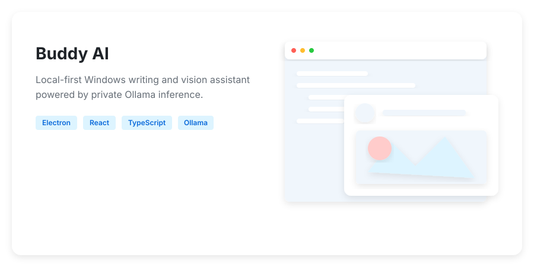
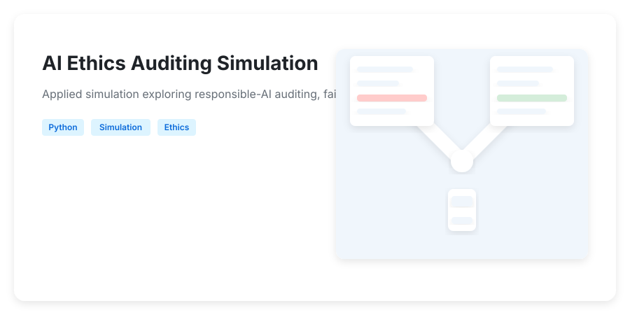
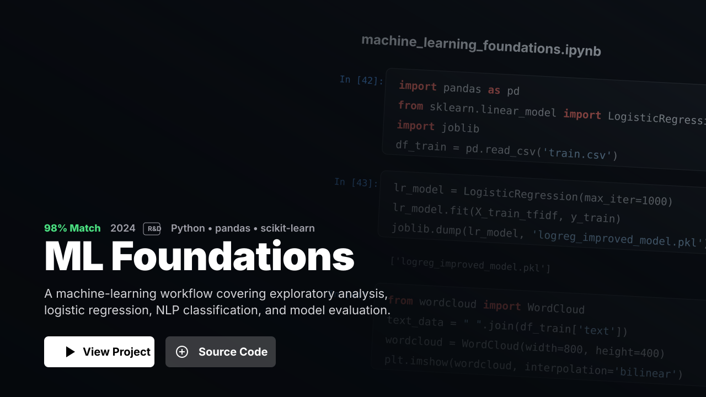
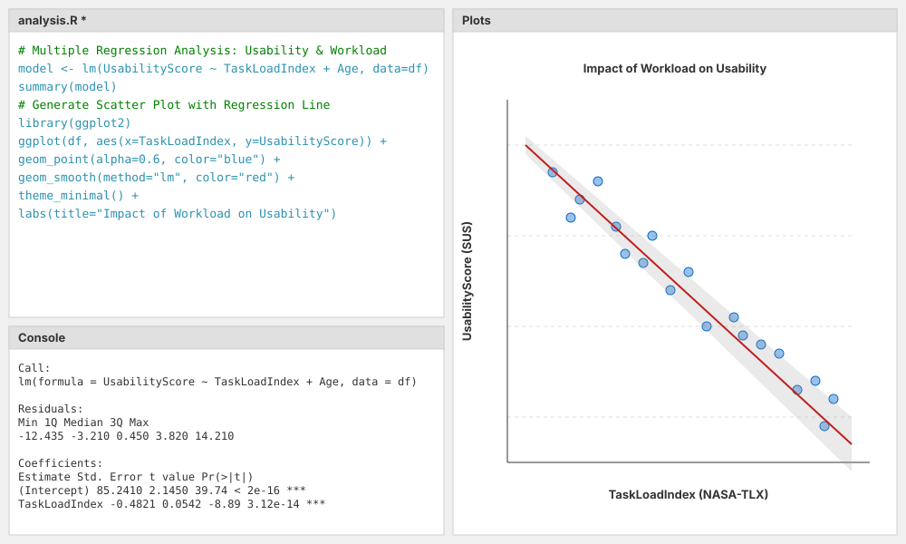
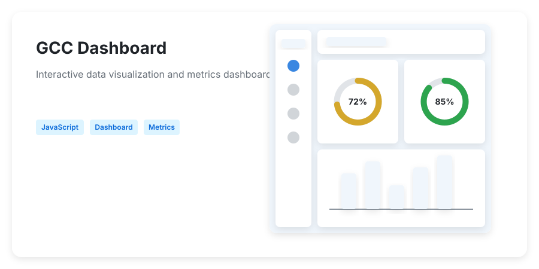

<picture>
  
</picture>

[Featured work](#featured-projects) &nbsp;·&nbsp; [All repositories](https://github.com/hemanthdsd?tab=repositories) &nbsp;·&nbsp; [LinkedIn](https://www.linkedin.com/in/hemanthdavuloori/) &nbsp;·&nbsp; [Email](mailto:saidurgahemanthdavuloori@gmail.com)

---

## Featured projects

 

### [OpsInsight AI](https://github.com/hemanthdsd/opsinsight-ai)
An AI-assisted manufacturing deviation and yield-intelligence platform for controlled and regulated environments.
  

  
<code>Angular 18</code> · <code>NestJS</code> · <code>PostgreSQL</code> · <code>Gemini</code> · <code>pgvector</code> 
**Focus:** Evidence-cited AI investigations · Human-in-the-loop review

 
 

### [Buddy AI](https://github.com/hemanthdsd/buddy-ai)
A local-first Windows writing and vision assistant powered by private Ollama inference.
  

  
<code>Electron</code> · <code>React</code> · <code>TypeScript</code> · <code>Ollama</code> 
**Focus:** Floating desktop assistant · Screen understanding

 
 

### [AI Ethics Auditing Simulation](https://github.com/hemanthdsd/AI-ethics-auditing-simulation)
An applied simulation exploring responsible-AI auditing, governance, fairness and risk.
  

  
<code>Python</code> · <code>Simulation</code> · <code>Ethics</code> 
**Focus:** Responsible-AI auditing · Governance · Fairness · Risk

 
 

### [Machine Learning Foundations](https://github.com/hemanthdsd/machine-learning-foundations-project)
A machine-learning workflow covering exploratory analysis, logistic regression, NLP and model evaluation.
  

  
<code>Python</code> · <code>pandas</code> · <code>scikit-learn</code> · <code>NLTK</code> 
**Focus:** Exploratory analysis · Logistic regression · NLP

 
 

### [Quantitative Data Analytics](https://github.com/hemanthdsd/Qantitative-Data-Analytics-)
Statistical research and visual analysis covering usability, workload and advertising effectiveness.
  

  
<code>R</code> · <code>RStudio</code> · <code>Regression</code> · <code>Hypothesis testing</code> 
**Focus:** Usability · Workload analysis · Advertising effectiveness

 
 

### [GCC Dashboard](https://github.com/hemanthdsd/Gcc-dashboard)
An interactive data visualization and metrics dashboard for streamlined business analytics.
  

  
<code>JavaScript</code> · <code>Dashboard</code> · <code>Metrics</code> 
**Focus:** Interactive data visualization · Progress metrics

---

## What I work with

**Product engineering** 
Angular · React · TypeScript · NestJS · Electron

**AI and data** 
Gemini · Ollama · Python · scikit-learn · R

**Platforms and storage** 
PostgreSQL · pgvector · Docker · GitHub

---

## Let’s connect

I am always open to conversations about AI, business analysis, full-stack engineering and data-product opportunities.

- **LinkedIn:** [https://www.linkedin.com/in/hemanthdavuloori/](https://www.linkedin.com/in/hemanthdavuloori/)
- **Email:** [saidurgahemanthdavuloori@gmail.com](mailto:saidurgahemanthdavuloori@gmail.com)
